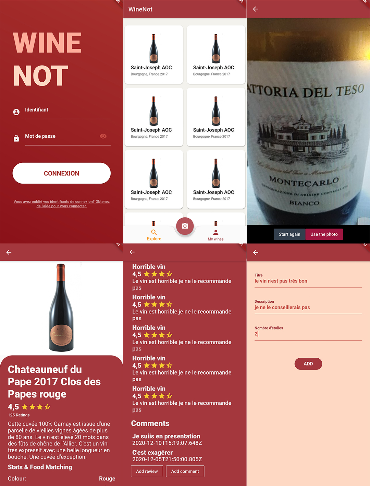
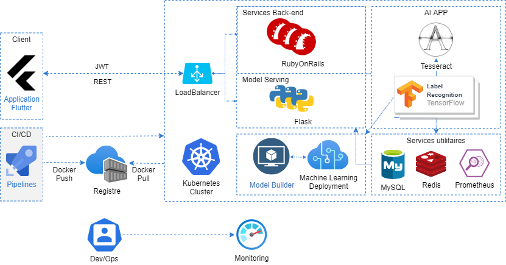

  

WineNot is an easy to use app to let you find a wine according to it's label. One step, Just can it !

## Architecture

  

## Dependencies

- API
  - `pip install -r requirements.txt`
  - `sudo apt-get install tesseract-ocr-fra`
- APP
  - [Install the Dart and Flutter SDK on your machine](https://flutter.dev/docs/get-started/install)
  - Enable the same extensions in Android Studio
- Backoffice
  - [Follow the starting guide of Rails](https://guides.rubyonrails.org/getting_started.html)

## Run the project

- Start the Rails server first
  - `cd Backoffice`
  - `sh run.sh`
  - Open your port 3000 to the in/out request on your firewall
- Then start the Flask server
  - `cd API`
  - `sh run.sh`
  - Open your port 5000 to the in/out request on your firewall
- Finally, compile the Flutter app on your mobile.
  - Go to AndroidStudio
  - Run the project

## Docker

- Run the docker process: `sudo service docker start`
- Compile the docker by going in the API or Backoffice folder and use the command `docker build .`
- Then go to your kubernetes dashboard

## Postman

- You can find a Postman collection in the `postman` directory in a way to show you the differents endpoints

## JMeter

- You can find a JMeter collection in the `JMeter` directory in a way to make a load testing

## Tensorflow Model

- You can find the tensorflow model in the `LabelExtractorTensorflow` directory
- In a way to make it works on your machine you need to change the differents path in the `LabelExtractorTensorflow/TF2_Model/LicencePlatesFR-TF2/workspace/training_demo/exported-models/my_mobilenet_model/pipeline.config` file at the lines:
  - 165, 175, 177, 185 and 189
